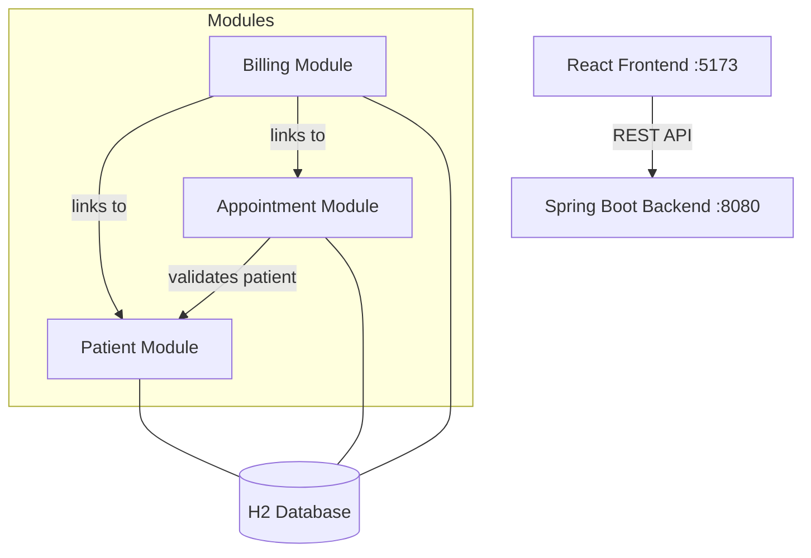

# Hospital Management System

A full-stack hospital management application built with Spring Boot and React. Handles patient records, appointment scheduling, and billing.

## Architecture



## Tech Stack

**Backend:** Java 17, Spring Boot 3.2.4, Spring Data JPA, H2 Database, Lombok, Maven

**Frontend:** React 19, Vite 8, React Router v7, Axios

## Modules

| Module | Description | API |
|--------|-------------|-----|
| Patient | Patient registration and profile management | `/api/patients` |
| Appointment | Scheduling linked to patients, status tracking (SCHEDULED / COMPLETED / CANCELLED) | `/api/appointments` |
| Billing | Invoice generation linked to patients and appointments, payment tracking (UNPAID / PAID) | `/api/bills` |

## Getting Started

### Prerequisites

- Java 17+
- Maven 3.8+
- Node.js 18+

### Backend

```bash
cd backend
mvn spring-boot:run
```

Backend starts at http://localhost:8080

### Frontend

```bash
cd frontend
npm install
npm run dev
```

Frontend starts at http://localhost:5173

## API Endpoints

| Method | Endpoint | Description |
|--------|----------|-------------|
| GET | `/api/patients` | List all patients |
| POST | `/api/patients` | Register new patient |
| DELETE | `/api/patients/{id}` | Remove patient |
| GET | `/api/appointments` | List all appointments |
| POST | `/api/appointments/patient/{id}` | Book appointment |
| PUT | `/api/appointments/{id}/status` | Update status |
| GET | `/api/bills` | List all bills |
| POST | `/api/bills/generate` | Generate invoice |
| PUT | `/api/bills/{id}/pay` | Mark as paid |
