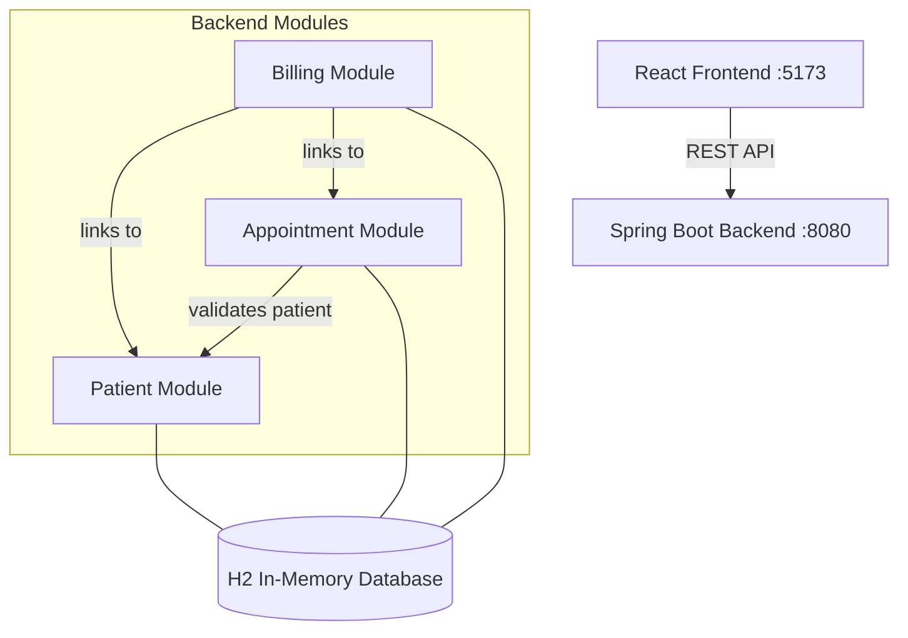

# Hospital Management System

> A full-stack modular monolith application built with Spring Boot and React for managing hospital operations including patient records, appointment scheduling, and billing.

## Architecture



## Tech Stack

**Backend:**
- Java 17, Spring Boot 3.2.4
- Spring Data JPA with H2 Database
- Lombok for boilerplate reduction
- Modular monolith architecture

**Frontend:**
- React 19, Vite 8
- React Router v7 for navigation
- Axios for HTTP requests

## Modules

### Patient Module
- Patient registration and profile management
- CRUD operations via `/api/patients`

### Appointment Module
- Schedule appointments linked to patients
- Status management: SCHEDULED → COMPLETED / CANCELLED
- API: `/api/appointments`

### Billing Module
- Generate invoices linked to patients and appointments
- Payment tracking: UNPAID → PAID
- API: `/api/bills`

## Getting Started

### Prerequisites
- Java 17+
- Maven 3.8+
- Node.js 18+

### Run Backend
```bash
cd backend
mvn spring-boot:run
```
Backend starts at http://localhost:8080

### Run Frontend
```bash
cd frontend
npm install
npm run dev
```
Frontend starts at http://localhost:5173

## API Endpoints

| Method | Endpoint | Description |
|--------|----------|-------------|
| GET | `/api/patients` | List all patients |
| POST | `/api/patients` | Register new patient |
| DELETE | `/api/patients/{id}` | Remove patient |
| GET | `/api/appointments` | List all appointments |
| POST | `/api/appointments/patient/{id}` | Book appointment |
| PUT | `/api/appointments/{id}/status` | Update status |
| GET | `/api/bills` | List all bills |
| POST | `/api/bills/generate` | Generate invoice |
| PUT | `/api/bills/{id}/pay` | Mark as paid |
